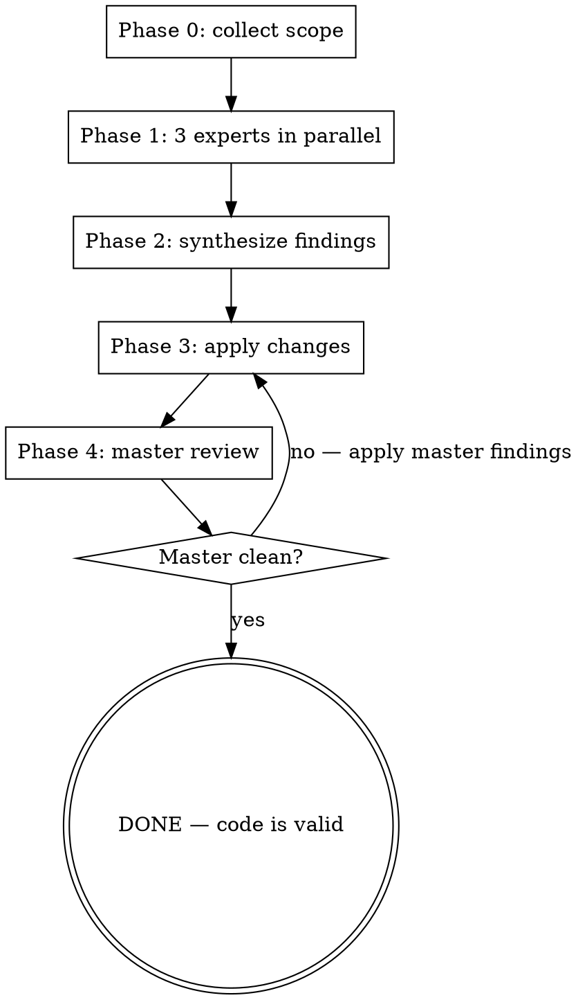

# Expert Review

Four-stage panel review for code that needs senior-grade verification before merge. Used when "shipping" matters more than "shipping fast". Inspired by the Hains saldi/abwesenheitsliste refactor where three specialist reviewers (perf, types, architecture) caught complementary issues that a single reviewer would miss.

**Core principle:** A single reviewer has blind spots; three specialists catch complementary issues; a master synthesizer prevents the panel from contradicting itself.

## When to invoke

**Mandatory:**
- After a refactor that touches > 300 LOC or > 5 files
- Before merging a feature that will be hard to revert (DB migrations, public APIs, RBAC changes)
- When the change touches a perf-critical path (virtualized tables, hot loops, DB-fanout endpoints)

**Strongly recommended:**
- When the user says "I want to be sure", "no surprises", "ship-ready", "don't want to break anything"
- After applying findings from a previous review pass (to verify the fix didn't introduce new debt)

**Skip:**
- Tiny bugfix (< 30 LOC, single file)
- Pure styling/comment changes
- Test-only changes

## Workflow

### Phase 0 — Collect scope

Before dispatching anything, the main thread must know:
1. **Target**: file paths, feature folder, or git diff range
2. **Constraints**: what the user explicitly told you not to change (e.g. "don't break the public API", "no DB schema changes")
3. **Tradeoffs already made**: design decisions the user accepted (e.g. "we chose Record over Map for now")

If any of these are missing — ASK the user before spawning agents. Do not let the experts re-litigate decisions the user already made.

### Phase 1 — Three experts in parallel

Dispatch **3 Agent tool calls in a single message** (parallel). Each agent gets their own prompt template from `prompts/`:

| Expert | Specialty | Prompt file |
|---|---|---|
| **Performance & Rendering** | React render scope, memo, virtualization, scroll/animation cost, network round-trips | `prompts/expert-performance.md` |
| **TypeScript & Domain Modeling** | Branded types, discriminated unions, primitive obsession, runtime validation, type sound­ness | `prompts/expert-types.md` |
| **Architecture & Codebase Fit** | State strategy, project boundaries (Nx libs), CLAUDE.md rule compliance, pattern consistency | `prompts/expert-architecture.md` |

Each agent returns a structured report (see prompt template). Reports are independent — do NOT show one expert's findings to another in phase 1.

**Important:** Tell each agent the constraints from Phase 0 so they don't waste capacity flagging design decisions the user already made.

### Phase 2 — Synthesize findings

Main thread (you) reads all three reports. Categorise every finding:
- **Critical** — bug, security issue, behaviour change, build break
- **Important** — perf cliff, type-safety hole, architecture inconsistency that will compound
- **Nit** — style, naming, comment quality
- **Skip** — already covered by another expert, or contradicts a Phase 0 constraint

Output a deduplicated, severity-sorted list. Show it to the user before applying anything. The user has veto power on every item.

### Phase 3 — Apply changes

Apply the user-approved changes. Use the appropriate tool (Edit, Write) — never the Agent tool here, because you need precise control and verification.

After applying:
- Run tsc on the affected projects (`docker exec ... npx tsc --noEmit ...`)
- Run eslint on the changed files
- If the project has a dev server / live container, restart and confirm no runtime errors

### Phase 4 — Master review

Dispatch **one Agent tool call** to the master reviewer using `prompts/expert-master.md`. The master gets:
- The original target + constraints from Phase 0
- The 3 expert reports from Phase 1
- The synthesised list from Phase 2
- The actual changes applied in Phase 3 (diff or file list)

Master's output is binary:
- **SHIP** — explicitly says "no further changes needed" + 3-line summary of what was verified
- **NOT SHIP** — lists remaining items with severity

If **SHIP** → done, code is valid.
If **NOT SHIP** → loop back to Phase 3 with the new findings. Maximum 3 master iterations to avoid infinite loops; if the 3rd master pass still finds Critical or Important issues, surface to the user and ask whether to keep going or accept the debt.

## What "SHIP" means

The master signs off only when:
1. Every Critical and Important finding from Phase 1+2 was resolved or explicitly accepted as debt
2. No new Critical or Important issue was introduced by Phase 3 changes
3. The change matches the user's Phase 0 constraints
4. tsc + eslint pass on the affected files
5. (If applicable) the dev server boots and the route loads without runtime errors

Anything less = **NOT SHIP**, loop back.

## Red flags (don't do this)

- **Sequential experts instead of parallel.** Phase 1 must be 3 parallel Agent calls in one message. Sequential takes 3× longer with no benefit.
- **Letting one expert see another's findings before Phase 2.** Each expert must reach their verdict independently or you'll get groupthink.
- **Skipping Phase 0.** If you don't capture the user's constraints, experts will flag design decisions the user already made and the master will perpetually fail.
- **Master sees the diff but not the original expert reports.** Master needs the full chain to detect "did Phase 3 actually address what Phase 1 found, or just churn?".
- **Applying changes inside the Agent tool.** Agents lose context — Phase 3 must be in the main thread so the verifier (Phase 4) reviews exactly what was committed.

## Anti-pattern: when not to use this skill

- Single small bugfix → use `code-review` or just ship
- "Make this faster" with no clear target → use `feature-dev:code-reviewer` or profile first
- Discussion/spike code that will be rewritten → wasted review capacity

## Reference: template prompt files

The four agent prompts live next to this file:
- `prompts/expert-performance.md`
- `prompts/expert-types.md`
- `prompts/expert-architecture.md`
- `prompts/expert-master.md`

Read them once. They contain the exact wording each agent should receive, plus the structured response format they must return.
